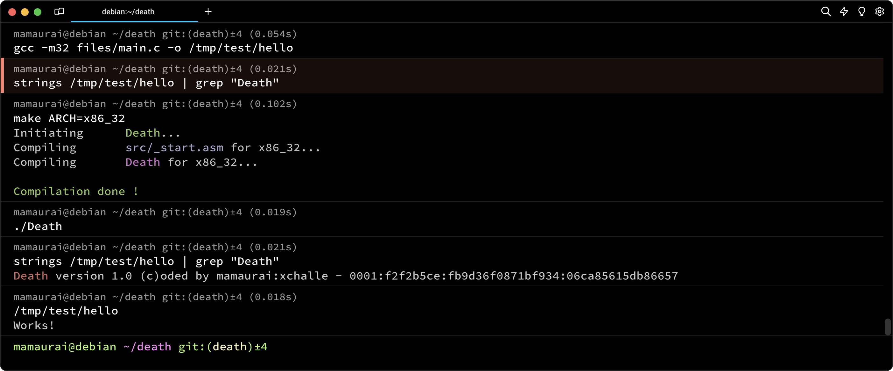
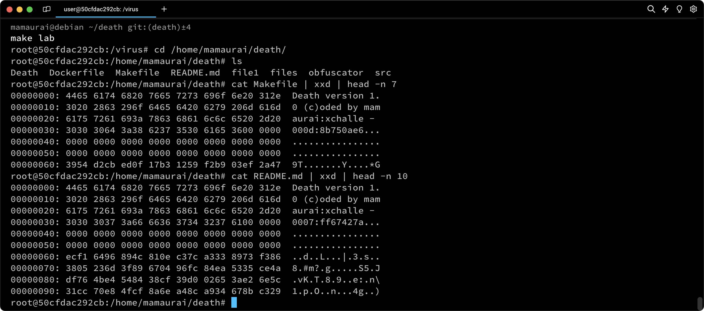

<p align="center">
  
</p>

---
<p align="center">
    
    
    
    
    
    
</p>


> A Simple Metamorphic Linux ELF virus designed to change it's own instructions at every duplication.

## 📝 Table of Contents

* [⛔️ Warning](#-warning)
* [❓ What is it](#-what-is-it)
* [⚙️ How it works](#-how-it-works)
* [⭐ Bonus features](#-bonus-features)
* [📋 Prerequisites](#-prerequisites)
* [🔧 Install](#-install)
* [🚀 Usage](#-usage)

## ⛔️ Warning

The sharing of this project on my GitHub aims to help peoples to open their minds to new logics or help peoples in case of difficulty. In no way, that aims to copy and paste this work on your own repository.

This executable can do great damage to your computer if it is run, I strongly recommend that you run it in a separate and secure environment away from your personal data.

## ❓ What is it

This project is a direct improvement of the previous viruses [War](https://github.com/mathias-mrsn/war), [Pestilence](https://github.com/mathias-mrsn/pestilence), and [Famine](https://github.com/mathias-mrsn/famine). Death requires us to create a virus that is hard to reverse engineer by employing metamorphic techniques, specifically instruction substitution in our case. Death builds upon the features implemented in the previous viruses, so I highly recommend reading [War README.md](https://github.com/mathias-mrsn/war/blob/master/README.md), [Pestilence README.md](https://github.com/mathias-mrsn/pestilence/blob/master/README.md), and [Famine README.md](https://github.com/mathias-mrsn/famine/blob/master/README.md) to understand what is incorporated into Pestilence.

This project aims to create an ELF executable that can embed its own code within a target file. In our case, our target is not a single file but two directories for the mandatory part. Those directories are `/tmp/test` and `/tmp/test2`. To consider a file "infected," the file must contain the virus code that we have coded. It should be executed by the file when you run it without altering its original behavior and without printing anything. Otherwise, our virus would be detected.

After being infected, the targeted file will contain a `signature` in this form: `Death version 1.0 (c)oded by mamaurai:xchalle - 0000:11111111:2222222222222222:3333333333333333`, where `0000` is just an index to determine the infection order of each process, `11111111` is the beginning of an encryption key used to encrypt the malicious payload every time the program is duplicated, and `2222222222222222` is computed by splitting the decryptor into 32-byte pieces and XORing them all together, representing the mutation of the decryptor signature.

The new part of the signature is `3333333333333333`. This part is created using the exact same technique as the previous War, by XORing 32-byte pieces of code together. But this time, instead of XORing the decryptor code (from `_virus` to `_decrypt`), we XOR the entire encrypted and packed code. All the virus will pass through the mutation engine to change every instruction in our code. This XOR operation will return a value that changes depending on the modifications inside our code after the usage of the mutation engine.

<p align="center">
  
</p>

War inherits features from [Famine](https://github.com/mathias-mrsn/famine), [Pestilence](https://github.com/mathias-mrsn/famine) and [War](https://github.com/mathias-mrsn/war), such as debugger detection, decryptor mutation, root infection, etc. I highly recommend reading the README.md of those three projects to understand what's inside this one.


## ⚙️ How it works

This project aims to create a Metamorphic virus. So, the first question is, what is a metamorphic virus?

Metamorphism is the evolution of polymorphism. This kind of virus is much rarer than polymorphism due to the complexity of developing a good and powerful virus. The type of these viruses is called `metaPHOR`, created in the beginning of the 2000s. This virus is a piece of art in virology, and I highly recommend you take a look at the reverse engineering reviews of this virus, which is extremely complex. So complex that it doesn't work every time it's launched.

A polymorphic virus changes the shape of its code, usually by adding NOP or junk code. The metamorphic virus is the next level; it doesn't change the structure of the code, but it changes the executable code by replacing opcodes with other opcodes that can achieve the same functionality. This technique is called `instruction substitution`. To understand this, let's take a very simple example:

```asm
mov     rax, 10     b8 0a 00 00 00
sub     rax, 5      48 83 e0 05 
; The value of rax is 5.
; The calcul is -> 10 - 5 = 5
```

If the code above is the original code then the code can be mutated to :

```asm
mov     rax, 10     b8 0a 00 00 00
add     rax, -5     48 81 e0 fb ff ff ff
; The value of rax is 5.
; The calcul is -> 10 + (-5) = 5
```

The binary code is different, but the logic is still the same. Now that we know what metamorphism is in a virus, I'm going to show you a few examples of substitutions between two infected binaries using `vimdiff`.

<p align="center">
  
  <i>ADD r, imm32/imm8 <--> SUB r, imm32/imm8</i>
</p>

<p align="center">
  
  <i>MOV r,imm32/imm8 <--> PUSH imm32/imm8 + POP r</i>
</p>

<p align="center">
  
  <i>MOV r,r --> PUSH r + POP r</i>
</p>

<p align="center">
  
   <i>PUSH r + POP r --> MOV r,r</i>
</p>

<p align="center">
  
   <i>JMP rel8/rel32 --> JX rel8/rel32 + JNX rel8/rel32</i>
</p>

<p align="center">
  
   <i>XOR r,r (with same register) <--> MOV r, 0x00</i>
</p>

## ⭐ Bonus features

This project opens the door to many potential bonuses. For this project, we have decided to implement six bonus features:

<details open>
<summary><b>32 Bits Compatibility</b></summary>
<br>

We decided to leverage the wide possibilities of NASM preprocessing to create a coding approach that works on both 64-bit and 32-bit architectures. Here is how assemble it for 32bits:
```shell
$ make ARCH=x86_32
$ ./Death
```

<p align="center">
  
</p>
</details>

<details open>
<summary><b>Root Infection</b></summary>
<br>

At the beginning of the infection routine, the virus will query the kernel for the UID to determine whether the executable has been run with root privileges or via sudo. If the UID is greater than zero, the virus will only infect `/tmp/test` and `/tmp/test2`, as explained above. However, if the UID is zero, indicating root privileges, the virus will infect the following directories: `/bin`, `/usr/bin`, `/usr/local/bin`. Subsequently, almost all executables on the machine will be infected and capable of infecting other files. For example, if you run `ls` as root in the `/home` directory, the resulting subfiles will be infected, potentially leading to the corruption of personal files with our signature.

<p align="center">
  
</p>
</details>

<details open>
<summary><b>Non-Binary Infection</b></summary>
<br>

As mentioned above, if the virus is executed as root in the `/home` directory, it will infect non-binary files. In this project, the infection involves placing the virus signature at the top of every file and encrypted the entire file with an AES-256 encryption algorithm.

<p align="center">
  
</p>
</details>

<details open>
<summary><b>Packer</b></summary>
<br>

Our virus implements a packing algorithm called `lzss`. This algorithm is designed to minimize the size of the virus within the targeted ELF. The code will be unpacked during runtime. The algorithm is lossless and relies on the repetition of patterns within the code.
</details>

<details open>
<summary><b>Backdoor</b></summary>
<br>

To make our virus even more impactful, we decided to implement a backdoor routine. This routine is executed after decryption and is designed to initiate a malicious process on your machine, which can be highly advantageous for an unauthorized person seeking access or to exploit your machine for financial gain.

The backdoor routine is a reverse shell, the virus will open a port in a separate process and listen for incoming requests on this port. Each request sent to this port will be redirected to a bash process, creating a reverse shell with the same privileges as the executor.

<p align="center">
  
</p>

</details>

<details open>
<summary><b>Full Obfuscation</b></summary>
<br>

To continue beyond Pestilence, we decided to retain the complete obfuscation of our code, as implemented in the previous virus. This is done to make our code difficult to understand, even for someone who can bypass the antidebugging checks.

<p align="center">
  
</p>
</details>

## 📋 Prerequisites

This virus has been developed and tested on `Debian 6.1.0-18-amd64`. On other systems, some undefined behavior may occur or certain features may not work as intended.

- `make`
- `nasm`
- `ld`

## 🔧 Install

```sh
$ git clone https://github.com/mathias-mrsn/death.git
```

## 🚀 Usage

```sh
# Run it in secure environment
$ cd death
$ make
[...]
$ (sudo) ./death
```

## 👥 Authors
- [@mathias-mrsn](https://github.com/mathias-mrsn)
- [@xchalle](https://github.com/xchalle)
